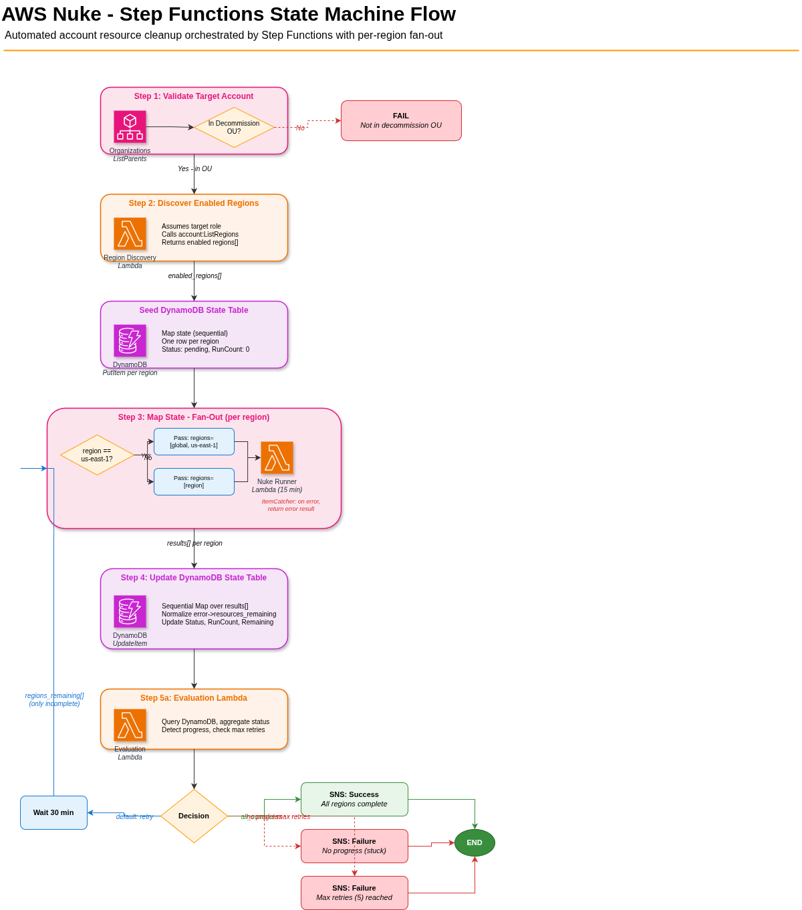

# AWS Nuke Resource Deletion — Step Functions Orchestrator

Automated AWS account resource cleanup using aws-nuke v3, orchestrated by Step Functions with per-region fan-out Lambda invocations.

## Documentation

- [Architecture](aws-nuke-resource-deletion-architecture.md) — Full system design, flow, IAM roles, retry logic, and deployment model
- [Work Plan](WORKPLAN.md) — Step-by-step implementation plan for the Step Functions state machine and supporting infrastructure

## State Machine Flow

