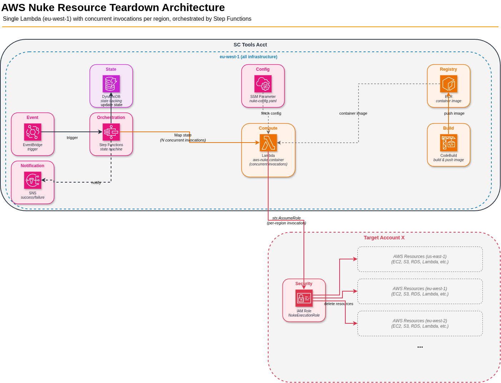

# AWS Nuke Resource Deletion Architecture



## Overview

Use aws-nuke from a single container Lambda in eu-west-1 (service catalog account), orchestrated by Step Functions, triggered by EventBridge for a specific target account. The state machine fans out concurrent invocations of the same Lambda (one per enabled region), passing region and cross-account parameters in the payload. Each invocation assumes a role in the target account and runs aws-nuke for the specified region. The retry loop continues until all resources are deleted, and SNS notifications fire on completion.

---

## Architecture Flow

```
EventBridge (target account event)
    → Step Functions (eu-west-1, service catalog account)
        → Step 1: Validate target account (is it in the OU? not in blocklist?)
        → Step 2: Discover enabled regions in target account
        → Step 3: Map state — invoke same Lambda concurrently (one invocation per region)
            - us-east-1 invocation: regions: [global, us-east-1]
            - All other invocations: regions: [<their-region>]
            - All invocations assume role in target account via aws-nuke --assume-role
        → Step 4: Collect results, update DynamoDB state table
        → Step 5: Choice state
            - All regions complete → SNS success
            - Resources remaining + retries < 5 + progress detected → Wait 30 min → Go to Step 3
            - No progress between runs → SNS failure (stuck resources)
            - Resources remaining + retries >= 5 → SNS failure (with details per region)
```

---

## Deployment Model (Single Lambda, Centralized)

All infrastructure lives in eu-west-1 in the service catalog account:

| Component | Location | Notes |
|-----------|----------|-------|
| ECR repo | eu-west-1 | Single repo, no cross-region replication needed |
| Lambda (container) | eu-west-1 | Single function, concurrent invocations handle parallelism |
| Step Functions | eu-west-1 | Orchestrates fan-out and retry logic |
| DynamoDB table | eu-west-1 | State tracking |
| SSM Parameter | eu-west-1 | Base nuke-config.yaml (uses `PLACEHOLDER_ACCOUNT` token; `regions:` block appended dynamically at runtime) |
| SNS topic | eu-west-1 | Completion/failure notifications |

**Why single-region Lambda works:** aws-nuke doesn't need to run *in* the target region. It makes API calls to regional endpoints from wherever it runs. A Lambda in eu-west-1 can delete resources in ap-southeast-1 — aws-nuke handles regional API routing internally via the `regions:` config key.

**Trade-offs:**
- ✅ One ECR repo, one Lambda deployment, one SSM parameter, one set of CloudWatch logs
- ✅ No cross-region replication, simpler CI/CD
- ⚠️ Single-region dependency on eu-west-1 (acceptable for internal cleanup tooling)
- ⚠️ Lambda concurrency pool is shared across all concurrent invocations — size reserved concurrency appropriately

---

## Global Resources Handling

IAM, Route 53, S3 buckets, and CloudFront distributions are global or us-east-1-specific. Only one invocation should handle these.

**Approach:**

- **us-east-1 invocation:** Step Functions passes `regions: ["global", "us-east-1"]` in the payload
- **All other invocations:** Step Functions passes `regions: ["<region>"]` — only their own region

The bootstrap script injects the `regions:` list into the nuke config dynamically based on the event payload.

---

## Lambda Event Payload (from Step Functions)

```json
{
  "target_account_id": "123456789012",
  "target_role_arn": "arn:aws:iam::123456789012:role/NukeExecutionRole",
  "region": "eu-west-1",
  "regions": ["eu-west-1"],
  "no_dry_run": true
}
```

For us-east-1:
```json
{
  "target_account_id": "123456789012",
  "target_role_arn": "arn:aws:iam::123456789012:role/NukeExecutionRole",
  "region": "us-east-1",
  "regions": ["global", "us-east-1"],
  "no_dry_run": true
}
```

---

## Direct Lambda Invocation (Testing)

For testing outside of Step Functions, invoke the Lambda directly via CLI:

```bash
aws lambda invoke \
  --function-name aws-nuke-runner \
  --cli-binary-format raw-in-base64-out \
  --payload '{
    "target_account_id": "123456789012",
    "target_role_arn": "arn:aws:iam::123456789012:role/NukeExecutionRole",
    "region": "eu-west-1",
    "regions": ["eu-west-1"],
    "no_dry_run": false
  }' \
  /tmp/nuke-response.json && cat /tmp/nuke-response.json | jq .
```

**Notes:**
- Set `no_dry_run` to `false` for a safe dry-run (default behavior)
- The payload schema is identical to what Step Functions passes — no adapter needed
- Check CloudWatch logs for the full aws-nuke output; the response file contains only the structured JSON summary
- For global resources testing, use `"regions": ["global", "us-east-1"]` with `"region": "us-east-1"`

---

## Lambda Structured Response

Each invocation returns structured JSON (not raw stdout) for Step Functions to make retry decisions:

```json
{
  "status": "resources_remaining",
  "region": "eu-west-1",
  "remaining_count": 12,
  "removed_count": 45,
  "failed_resources": ["s3-bucket-xyz", "eni-abc123"],
  "error": null
}
```

Possible `status` values: `complete` | `resources_remaining` | `error`

---

## Bootstrap Script (Lambda Custom Runtime)

```bash
#!/bin/bash
set -euo pipefail

# Fetch base nuke config from SSM (once per cold start)
aws ssm get-parameter \
  --name "/aws-nuke/config" \
  --with-decryption \
  --query "Parameter.Value" \
  --output text > /tmp/nuke-config-base.yaml

# Lambda custom runtime loop
while true; do
  HEADERS="$(mktemp)"
  EVENT_DATA=$(curl -sS -LD "$HEADERS" "http://${AWS_LAMBDA_RUNTIME_API}/2018-06-01/runtime/invocation/next")
  REQUEST_ID=$(grep -Fi Lambda-Runtime-Aws-Request-Id "$HEADERS" | tr -d '[:space:]' | cut -d: -f2)

  # Error trap — report failures to Runtime API
  trap 'curl -sS -X POST "http://${AWS_LAMBDA_RUNTIME_API}/2018-06-01/runtime/invocation/$REQUEST_ID/error" \
    -d "{\"errorMessage\":\"Bootstrap crashed\",\"errorType\":\"RuntimeError\"}"' ERR

  # Extract parameters from Step Functions payload
  export AWS_ASSUME_ROLE=$(echo "$EVENT_DATA" | jq -r '.target_role_arn')
  export AWS_ASSUME_ROLE_SESSION_NAME="nuke-$(echo "$EVENT_DATA" | jq -r '.region')-$(date +%s)"
  TARGET_ACCOUNT_ID=$(echo "$EVENT_DATA" | jq -r '.target_account_id')
  REGION=$(echo "$EVENT_DATA" | jq -r '.region')
  NO_DRY_RUN=$(echo "$EVENT_DATA" | jq -r '.no_dry_run // "false"')

  # Inject target account into nuke config
  cp /tmp/nuke-config-base.yaml /tmp/nuke-config.yaml
  sed -i "s/PLACEHOLDER_ACCOUNT/${TARGET_ACCOUNT_ID}/g" /tmp/nuke-config.yaml

  # Append regions block dynamically (not present in base config)
  REGIONS_BLOCK="regions:"
  for r in $(echo "$EVENT_DATA" | jq -r '.regions[]'); do
    REGIONS_BLOCK="${REGIONS_BLOCK}\n  - ${r}"
  done
  echo -e "$REGIONS_BLOCK" >> /tmp/nuke-config.yaml

  # Build aws-nuke command
  NUKE_CMD="aws-nuke run --config /tmp/nuke-config.yaml --no-prompt --no-alias-check"
  if [ "$NO_DRY_RUN" = "true" ]; then
    NUKE_CMD="$NUKE_CMD --no-dry-run"
  fi

  echo "=== aws-nuke run (region=$REGION, no_dry_run=$NO_DRY_RUN) ==="
  NUKE_OUTPUT=$($NUKE_CMD 2>&1 || true)
  echo "$NUKE_OUTPUT" >&2

  # Parse output into structured response
  RESPONSE=$(echo "$NUKE_OUTPUT" | /var/task/parse-nuke-output.sh "$REGION")

  # Return structured JSON to Lambda Runtime API
  curl -sS -X POST "http://${AWS_LAMBDA_RUNTIME_API}/2018-06-01/runtime/invocation/$REQUEST_ID/response" \
    -d "$RESPONSE"
done
```

**Key differences from previous design:**
- Appends `regions:` block dynamically from the payload (no per-region SSM parameters, no `sed` replacement)
- Injects target account ID by replacing `PLACEHOLDER_ACCOUNT` token in base config
- Error trap posts to `/error` endpoint on crash
- Parses aws-nuke output into structured JSON via `parse-nuke-output.sh`

> **See also:** [Create Docker Container with CodeBuild](create-docker-container-with-codebuild.md) — Point 2 (bootstrap details) and Point 3 Option B (inline buildspec with NO_SOURCE).

---

## Cross-Account Execution (aws-nuke v3 Built-in Support)

aws-nuke v3 (ekristen/aws-nuke) natively supports cross-account role assumption — no manual `sts assume-role` needed.

**Requirements:**

1. **Target account** has a role (e.g., `NukeExecutionRole`) with:
   - `AdministratorAccess` policy
   - Trust policy allowing the Lambda execution role in the service catalog account

2. **Lambda execution role** in the service catalog account has `sts:AssumeRole` permission on the target role

**All supported auth options (v3):**

| Method | CLI Flag | Environment Variable |
|--------|----------|---------------------|
| Assume Role ARN | `--assume-role` | `AWS_ASSUME_ROLE` |
| Session Name | `--assume-role-session-name` | `AWS_ASSUME_ROLE_SESSION_NAME` |
| Profile | `--profile` | `AWS_PROFILE` |
| Region | `--region` | `AWS_REGION` |

The bootstrap sets `AWS_ASSUME_ROLE` from the event payload — aws-nuke handles the STS call internally.

**Note:** STS session token expiry is not a concern since Lambda's max timeout (15 min) is well within the default 1-hour session duration.

---

## IAM Roles Required (3 Total)

| # | Role | Account | Trusted By | Key Permission |
|---|------|---------|------------|----------------|
| 1 | StepFunctionsExecutionRole | Service Catalog | `states.amazonaws.com` | Invoke Lambda, DynamoDB, SNS |
| 2 | NukeLambdaExecutionRole | Service Catalog | `lambda.amazonaws.com` | `sts:AssumeRole` into target |
| 3 | NukeExecutionRole | Target | Lambda role in service catalog account | `AdministratorAccess` |

### Trust Policies

**Role 1 — StepFunctionsExecutionRole:**
```json
{
  "Version": "2012-10-17",
  "Statement": [
    {
      "Effect": "Allow",
      "Principal": { "Service": "states.amazonaws.com" },
      "Action": "sts:AssumeRole",
      "Condition": {
        "StringEquals": { "aws:SourceAccount": "SERVICE_CATALOG_ACCOUNT_ID" }
      }
    }
  ]
}
```

**Role 2 — NukeLambdaExecutionRole:**
```json
{
  "Version": "2012-10-17",
  "Statement": [
    {
      "Effect": "Allow",
      "Principal": { "Service": "lambda.amazonaws.com" },
      "Action": "sts:AssumeRole",
      "Condition": {
        "StringEquals": { "aws:SourceAccount": "SERVICE_CATALOG_ACCOUNT_ID" }
      }
    }
  ]
}
```

**Role 3 — NukeExecutionRole (most security-sensitive — carries AdministratorAccess):**
```json
{
  "Version": "2012-10-17",
  "Statement": [
    {
      "Effect": "Allow",
      "Principal": {
        "AWS": "arn:aws:iam::SERVICE_CATALOG_ACCOUNT_ID:root"
      },
      "Action": "sts:AssumeRole",
      "Condition": {
        "ArnEquals": {
          "aws:PrincipalArn": "arn:aws:iam::SERVICE_CATALOG_ACCOUNT_ID:role/NukeLambdaExecutionRole"
        }
      }
    }
  ]
}
```

### Permission Policies

**Role 1 — StepFunctionsExecutionRole:**
- `lambda:InvokeFunction` — invoke the nuke Lambda
- `dynamodb:PutItem`, `UpdateItem`, `GetItem`, `Query` — state tracking
- `sns:Publish` — completion/failure notifications

**Role 2 — NukeLambdaExecutionRole:**
- `sts:AssumeRole` on `arn:aws:iam::TARGET_ACCOUNT_ID:role/NukeExecutionRole`
- `ssm:GetParameter` — pull nuke-config.yaml from SSM
- `logs:CreateLogGroup`, `CreateLogStream`, `PutLogEvents` — CloudWatch logging

**Role 3 — NukeExecutionRole:**
- `AdministratorAccess` (AWS managed policy) — aws-nuke needs broad permissions to discover and delete all resource types

### Security Considerations

| Concern | Mitigation |
|---------|-----------|
| Role 3 has AdministratorAccess | Necessary for aws-nuke; only deploy Role 3 in accounts meant for cleanup |
| Rogue Lambda in service catalog account | Trust policy on Role 3 uses `ArnEquals` condition — only the specific Lambda execution role ARN can assume it, even though the principal is account root |
| Someone modifies the Lambda execution role | SCPs + IAM permission boundaries on the service catalog account prevent unauthorized modifications |
| eu-west-1 outage blocks all cleanup | Acceptable risk for internal tooling; failover not required |

---

## State Tracking with DynamoDB

A single-region DynamoDB table (eu-west-1, same as Step Functions) tracks execution state. Step Functions updates the table after each retry cycle — Lambdas simply return their status.

**Table schema:**

| Attribute | Type | Description |
|-----------|------|-------------|
| `AccountId` | PK (String) | Target account being nuked |
| `Region` | SK (String) | AWS region (e.g., `us-east-1`) |
| `ExecutionId` | String | Step Functions execution ARN |
| `RunCount` | Number | Number of deletion cycles completed for this region |
| `Status` | String | `in_progress` \| `complete` \| `failed` \| `resources_remaining` |
| `RemainingCount` | Number | Resources still pending deletion |
| `LastUpdated` | String | ISO timestamp of last update |

**Flow:**
1. Step Functions starts execution → writes initial rows (one per region, RunCount=0)
2. Lambda invocations execute and return structured JSON
3. Step Functions updates `RunCount`, `Status`, `RemainingCount` per region
4. Choice state reads aggregated status to decide: retry, succeed, or fail

---

## Retry Logic

- **Max retries:** 5 (configurable)
- **Wait between retries:** 30 minutes
- **Early termination:** If `remaining_count` doesn't decrease between consecutive runs for a region, mark it as `failed` (stuck resources)
- **Total max duration:** ~2.5 hours (5 retries × 30 min)

Resources that commonly cause retries:
- S3 buckets (object deletion takes time)
- CloudFront distributions (15-30 min disable/delete)
- RDS instances (backup/deletion window)
- KMS keys (7-30 day pending deletion — will never complete via retry)

---

## Lambda 15-Minute Timeout

A single region with many resources can exceed 15 minutes. The retry loop handles this:
- aws-nuke deletes what it can within the timeout
- Lambda returns `resources_remaining` with the count
- Next retry picks up where it left off

The bootstrap captures aws-nuke's partial progress and reports it — no work is lost on timeout.

---

## Settings for Protected Resources

The base nuke-config.yaml in SSM uses `PLACEHOLDER_ACCOUNT` as a token that gets replaced dynamically at runtime. The `regions:` block is **not** included in the base config — it is appended dynamically by the bootstrap script based on the event payload:

```yaml
bypass-alias-check-accounts:
  - "PLACEHOLDER_ACCOUNT"

accounts:
  "PLACEHOLDER_ACCOUNT":
    filters:
      IAMRole:
        - type: "glob"
          value: "OrganizationAccountAccessRole"

settings:
  EC2Instance:
    DisableDeletionProtection: true
    DisableStopProtection: true
  RDSInstance:
    DisableDeletionProtection: true
  ELBv2:
    DisableDeletionProtection: true
  CloudFormationStack:
    DisableDeletionProtection: true
```

See the full list of all 22 settings-capable resources: [aws-nuke Settings-Capable Resources](settings-capable-resources.md)

---

## EventBridge Event Schema

Trigger options:
- Custom event from a self-service portal
- AWS Organizations event (account moved to a "decommission" OU)
- Scheduled rule

The event must include `target_account_id` and `target_role_arn`. The Step Functions input transformation maps these into the per-region Lambda payloads.

---

## Alternative Options

| Approach | Pros | Cons |
|----------|------|------|
| **Single Lambda + Step Functions (current)** | Simplest deployment, single region, cost-efficient | 15-min timeout, eu-west-1 dependency |
| **Multi-region Lambda + Step Functions** | Survives regional outage, lower API latency | Complex deployment, ECR replication |
| **Fargate + Step Functions** | No timeout limit | Higher cost if idle, slower cold start |
| **Hybrid: Lambda first pass, Fargate for stragglers** | Best of both | More complex deployment |

### Recommendation

Single Lambda + Step Functions in eu-west-1 with:
1. Account validation as the first step
2. Global resource isolation to us-east-1 invocation
3. Structured Lambda responses for intelligent retry
4. 5 retries with "no progress" early termination
5. Region-specific config injected from event payload (no per-region SSM params)
